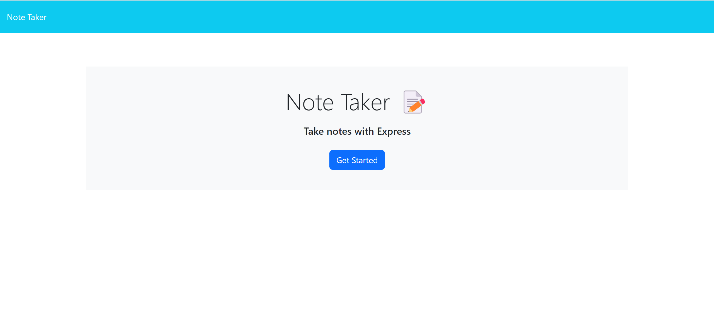
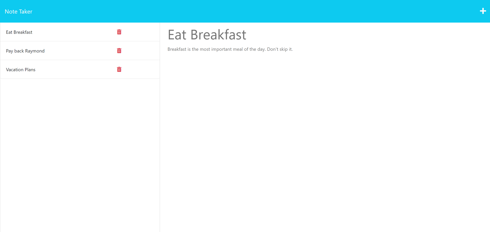

# 11 Express.js: Note Taker
## Description
Given starter code, the goal of this project is to create a server routes for a notes application. The notes application should save newly created notes, pull existing notes within the database json, and delete notes from the database. The GET route reads data from the database json and outputs it in the notes.html. POST route takes the note that the user has written and adds the entry onto the database.json data. DELETE route removes the entry matching the id of the note from the html and database json.
## Installation
npm i

## Usage
The applications can be accessed via https://namhn123.github.io/challenge-10/
Video tutorial: https://drive.google.com/file/d/1DnkL04kpk-Zc2vlXqY6COcrh2TVXs3et/view

